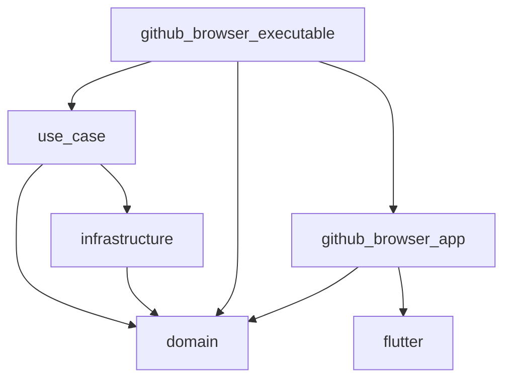

# flutter-engineer-codecheck-2024

# サンプルアプリの特徴

このリポジトリは、Flutterを使用して開発したサンプルアプリケーションです。5層のレイヤーアーキテクチャとMVVMモデルをベースに実装されており、さまざまな設計パターンや技術を取り入れています。

## インストールと実行
### インストール
```
git clone https://github.com/xaatw0/flutter-engineer-codecheck-2024.git
cd  flutter-engineer-codecheck-2024

dart pub global activate melos
dart pub global activate fvm
fvm use --force
melos init
```

### 実行
```
melos run_dummy
melos run_slow
melos run_dev
melos run_prod
```

- dummy: ダミーデータで実行
- slow: アニメーション確認用に、レポジトリのダミーデータを1つ読み込み、2秒待機する
- dev: 開発用のFlavorでGithubに接続して実行
- prod: 製品版のFlavorでGithubに接続して実行

## 開発のメモ
以下に開発時のメモを残しました。ご参照いただけると幸いです。[ここ](developers_memo.md)

## アーキテクチャ概要



各パッケージの依存性は[こちら](dependencies.md)
全てのパッケージがFlutterに依存している。UI層以外をFlutterからの依存からはずそうとしてが、AndroidStudioでのテストで失敗することが分かった。問題なく動作するようにしたい。

### 5層のレイヤーアーキテクチャとMVVMモデル

本アプリは、5層のレイヤーアーキテクチャとMVVM（Model-View-ViewModel）モデルを基盤として構築されています。これにより、コードの再利用性や保守性、テストの容易性を高めています。

### 各レイヤーの詳細

#### 実行可能層(Executable Layer: github_browser_executable)

- **役割**: アプリケーションのエントリーポイント。
- **詳細**: 実際のアプリを起動し、ServiceLocatorを介してユースケースなどを指定します。これにより、テスト用の特定のユースケース(通常のWEBデータ読み込みとダミーデータの読み込み)やFlavorの切り替えが可能です。
- **参照**:  書籍「なぜ依存を注入するのか　DIの原理・原則とパターン」

#### UI層(github_browser_app)

- **役割**: ユーザーインターフェースの構築。
- **詳細**: Flutterで画面を構成しており、通常のFlutterアプリと同様の実装を行っています。

#### ドメイン層(domain)

- **役割**: 業務知識やビジネスロジックを保持。
- **詳細**: GitHubのデータ読み込みなど、アプリのドメインに関連するデータを含みます。ServiceLocatorやユースケースを抽象クラスとして定義することで、他の層が具体的な実装を知らずに開発を進められます。

#### ユースケース層(use_case)

- **役割**: ドメイン層とインフラストラクチャー層の橋渡し。
- **詳細**: ドメイン層のデータとインフラストラクチャー層のデータ形式の違いを吸収します。インフラストラクチャー層で変更があっても、この層のみの修正で済み、他の層に影響を与えません。ページごとにユースケースを作成することで、そのページの機能を明確化できます。

#### インフラストラクチャー層(infrastructure)

- **役割**: 外部サービスとの連携。
- **詳細**: API通信やデータベース操作などを担当します。ピュアなDartで実装し、状態を持たない設計にしています。

### MVVMモデル
UI層内で内で、以下のように構成している
- Model: RiverpodのModelやユースケース、など
- View: FlutterのWidget
- ViewModel: RiverpodのState

## Melosによるマルチパッケージ管理

Melosを使用してマルチパッケージ管理を実現しています。各コマンドをMelosの設定内に記述することで、Flavorの切り替えや特殊なユースケースの実行方法を簡単に確認できます。

## Flavorの導入

開発環境（dev）と製品版（prod）の2つのFlavorを導入しています。Flavorを切り替えることで、アプリアイコンやステータスバーの色が変更されます。実際の運用では、Firebaseなどの外部APIのエンドポイントを切り替えることも可能です（今回は未実装）。

## ServiceLocatorの導入

ServiceLocatorを使用しています。以前はGetItによる依存性注入（DI）を行っていましたが、テスト時に何を注入すれば良いか分かりにくい問題がありました。ServiceLocatorにより、開発者が設定すべき内容を明確に把握できます。

## 多言語化対応

Flutterの標準的な多言語化機能を利用して、日本語と英語に対応しています。ただ、実行可能層からUI層を参照しているため、AppLocalization関連を通常のクラス(package:github_browser_app/gen_l10n/app_localizations.dart)として生成しています。

## GitHub Actionsの使用

GitHub Actionsを用いてAPKのビルドを自動化しています。`develop`ブランチへのプルリクエスト時にAPKが生成され、レビュー担当者は実機での動作確認が容易になります。iOSのビルドはコストの問題から未対応です。ビルド時にテストも実行し、品質を担保しています。

## Isolateの使用

JSONの変換処理でIsolateを使用しています。効果は限定的かもしれませんが、パフォーマンスの向上を図っています。

## Riverpodによる状態管理

状態管理にはRiverpodを採用しています。更新が必要な部分のみを監視し、`select`メソッドを活用してリビルド回数を削減しています。
Providerはアプリ全体とページ毎に作成しています。

## レスポンシブ対応

BuildContextにレスポンシブ用のメソッド `responsive` を extension として追加することで、簡単にレスポンシブ対応を実現しています。この方法が最もシンプルで効果的と考えてます。

## Humble Objectパターンによるテスト

UIのテストにはHumble Objectパターンを採用しています。例えば、×ボタン押下でダイアログを表示し、「はい」「いいえ」の選択により処理が変化する機能を実装しています。通常難しいUIのテストも、このパターンを使うことでダイアログの入力をシミュレートし、テスト可能です。
AskIfReset: Humble Object。ダイアログの返信のベースとなるメソッドを定義する
SearchRepositoriesPage: ダイアログの返答で動作が変わるのでテストしたいが、ダイアログの返信のためテストしにくい。テストしにくい箇所をAskIfResetのインターフェースとして実装し、ダイアログの表示と返信処理の動作を実装する
search_repositories_state_test.dart: AskIfResetのモックを作成して、AskIfResetのメソッドの返信により、動作が変わる(リセットする、しない)ことをテストする

## 設定ページの追加

アプリに設定ページを追加しました。

- **ページ遷移**: GoRouterを使用。
- **テンプレート活用**: 共通のレイアウトとしてテンプレートを作成し、ボトムナビゲーションバーを統一しています。
- **設定項目**:
    - **テーマモード**: ライト、ダーク、システム設定に応じたモードに切り替え可能。
    - **テーマカラー**: 好みのカラーを選択可能。マテリアルU対応端末では、人の顔アイコンのボタンでシステムのアクセントカラーを適用できます。

## リストビューの実装

読み込んだリポジトリの一覧を表示するために、リストビューを使用しています。

- **無限スクロール**: リストの末尾までスクロールすると、ローディング中を示す回転アニメーションが表示されます。データの読み込みが完了すると、自動的に消えます。

##  Github用のクラスの作成
- GithubからデータをJSONとしてダウンロードした
- ChatGPTにJSONファイルからDartクラスとテストを生成させる
- テストはMockitoを使用してhttp.Clientをモックして実施している

## アニメーション
- レポジトリ読み込み中のアイコンの回転
- ボタンの入れ替え

## 外部パッケージ
- modeless_drawer: リポジトリの詳細を表示するのに使用。自分で開発して、pub.devに一般公開している。

## サジェストキーワード
AutoCompleteを使用して、サジェストワードを実装。単純に単語の一覧を持っていて、それを出力している。実際はサーバから取得するようにする。
ユーザが検索したキーワードも履歴として保持している。

## 4層アーキテクチャの問題点と解決策

- **問題点**: 実行可能層のない4層アーキテクチャでは、UI層がインフラストラクチャー層のクラスを直接知る必要があり、依存性が高かった。
- **解決策**: 実行可能層の導入により、UI層がインフラストラクチャー層の詳細を知らなくても動作可能になりました。これにより、モジュール間の依存を減らし、保守性を向上させました。

## UI層の構成

UI層のページ図の構成について説明します。以下のガイドラインに従ってPgesおよびWidgetを整理することで、コードの可読性と再利用性を向上させています。

### 共通ウィジェットとPage

- **共通ウィジェット**
    - アトミックデザインに基づき、共通で使用するウィジェットは `widgets` ディレクトリ内でアトム（Atoms）、モレキュール（Molecules）、オーガニズム（Organisms）、テンプレート（Templates）ごとに整理されています。
    - これにより、再利用可能なコンポーネントを一元管理し、開発効率を向上させています。

- **Pageのウィジェット**
    - 各ページ専用のウィジェットは、ページごとのディレクトリ内に配置します。
    - メインページから派生する各ページにはドットマークが付いています（例：`search_repositories_page.dart` から派生する `search_repositories_page.detail_drawer.dart` など）。
    - 各派生ページは、`part of`を使い、そのページ専用のウィジェットとして定義しています。これにより、特定のページでのみ使用されるウィジェットが他のページで使用されることを防ぎます。

### アトミックデザインの考え方

本アプリケーションでは、アトミックデザインの原則に基づき、UIコンポーネントを体系的に整理・構築しています。アトミックデザインにはさまざまな解釈がありますが、本プロジェクトでは以下のように定義・実装しています。

#### Atoms

- **定義**: テキストやボタンなど、最も基本的なUI要素。これらは単一の機能を持ち、他のコンポーネントの基礎を形成します。
- **実装方法**:
  - 基本的なウィジェットの機能を制限するために、新しいウィジェットをアトムとして定義しています。
  - アプリ内で使用するテキストのスタイルを統一し、ファクトリーコンストラクターを用いてサイズや色などが自動的に設定されるようにしています。

### Molecules

- **定義**: 2つ以上のアトムズを組み合わせたコンポーネント。外観を形成するが、独自の機能は持たない。
- **実装方法**:
  - モレキュルス自体は機能を持たず、上位のページから実行したい処理を引数としてファンクションで渡す設計としています。

### Organisms

- **定義**: 複数のアトムズやモレキュルスを組み合わせ、独自の機能や状態を持つ複雑なコンポーネント。
- **実装方法**:
  - オーガニズムは単独で動作可能なコンポーネントとして設計されており、必要な機能や状態を内部に持ちます。

### Templates

- **定義**: ページの共通部分を定義し、各ページで再利用可能なレイアウトを提供するコンポーネント。状態を持てる(ログイン状態など)
- **実装方法**:
  - アプリ全体で共通するページの外枠（ボトムナビゲーションバー、メニュードロワー、ユーザーアイコンなどのセット）をテンプレートとして定義します。
  - テンプレートは各ページの外側に配置し、ページ自体の状態管理や機能実装に干渉しないようにします。
  - テンプレートはMaterialPageの中、Pageの外に設置します。ページ間で一貫性を保ちます

```
 MaterialPage(
   child: NonAuthenticatedTemplate(
     child: WidgetPage()))
```

### ページの構成

- **定義**: 各画面（ページ）はウィジェットとは別に、専用のディレクトリに配置します。
- **実装方法**:
  - ページは `pages/` ディレクトリ内に配置し、ウィジェットディレクトリ（`widgets/`）とは同列に構成します。


## 課題

本アプリケーションのさらなる改善に向けて、以下の課題が残っています。これらを解決することで、より堅牢で拡張性の高いアプリケーションを目指します。

1. **ドメイン層のHTTPクライアント定義**: 現在、インフラストラクチャー層が直接`http`パッケージに依存しています。ドメイン層で`http.client`を定義し、これを継承することでインフラ層の`http`パッケージへの依存性を排除する必要があります。

2. **テストの拡充**: ゴールデンテストやウィジェットテストの実装が不足しています。特にUIコンポーネントの見た目や動作を自動で検証するテストケースの追加が求められます。

3. **UIの操作性向上**: 現在のUIはスクロールダウンのみの操作ですが、リスト項目を右にスワイプすることで次のページやリストに移行する機能を実装することで、ユーザーエクスペリエンスを向上させられると思われる

4. **アトミックデザインの完全実装**: アトミックデザインに基づき、atoms、molecules、organisms、templates, pagesの5つに分けて実装しています。atoms、molecules、organismsをWidgetBookとしてまとめ、デザイナーと共有することで、他プロジェクトも含めてUIコンポーネントの再利用性と開発効率をさらに高めることが可能です。


## 実行環境
### Windows
```
 fvm flutter doctor -v

[√] Flutter (Channel stable, 3.24.0, on Microsoft Windows [Version 10.0.22631.4317], locale ja-JP)
    • Flutter version 3.24.0 on channel stable at C:\Users\{UserName}\fvm\versions\3.24.0
    • Upstream repository https://github.com/flutter/flutter.git
    • Framework revision 80c2e84975 (3 months ago), 2024-07-30 23:06:49 +0700
    • Engine revision b8800d88be
    • Dart version 3.5.0
    • DevTools version 2.37.2

[√] Windows Version (Installed version of Windows is version 10 or higher)

[√] Android toolchain - develop for Android devices (Android SDK version 34.0.0)
    • Android SDK at C:\Users\{UserName}\AppData\Local\Android\sdk
    • Platform android-34, build-tools 34.0.0
    • Java binary at: C:\Program Files\Android\Android Studio\jbr\bin\java
    • Java version OpenJDK Runtime Environment (build 21.0.3+-12099254-b509.4)
    • All Android licenses accepted.

[√] Chrome - develop for the web
    • Chrome at C:\Program Files\Google\Chrome\Application\chrome.exe

[√] Visual Studio - develop Windows apps (Visual Studio Community 2022 17.8.0)
    • Visual Studio at C:\Program Files\Microsoft Visual Studio\2022\Community
    • Visual Studio Community 2022 version 17.8.34309.116
    • Windows 10 SDK version 10.0.22621.0


[√] Android Studio (version 2024.2)
    • Android Studio at C:\Program Files\Android\Android Studio
    • Flutter plugin can be installed from:
       https://plugins.jetbrains.com/plugin/9212-flutter
    • Dart plugin can be installed from:
       https://plugins.jetbrains.com/plugin/6351-dart
    • Java version OpenJDK Runtime Environment (build 21.0.3+-12099254-b509.4)

[√] Connected device (4 available)
    • Pixel 4a 5G (mobile) • 09271JECB0---- • android-arm64  • Android 14 (API 34)
    • Windows (desktop)    • windows        • windows-x64    • Microsoft Windows [Version 10.0.22631.4317]
    • Chrome (web)         • chrome         • web-javascript • Google Chrome 129.0.6668.101
    • Edge (web)           • edge           • web-javascript • Microsoft Edge 129.0.2792.89

[√] Network resources
    • All expected network resources are available.

• No issues found!

```

### Mac
```
 fvm flutter doctor -v
[✓] Flutter (Channel stable, 3.24.0, on macOS 14.5 23F79 darwin-arm64, locale ja-JP)
    • Flutter version 3.24.0 on channel stable at /Users/{UserName}/fvm/versions/3.24.0
    • Upstream repository https://github.com/flutter/flutter.git
    • Framework revision 80c2e84975 (3 months ago), 2024-07-30 23:06:49 +0700
    • Engine revision b8800d88be
    • Dart version 3.5.0
    • DevTools version 2.37.2

[✓] Android toolchain - develop for Android devices (Android SDK version 33.0.0-rc4)
    • Android SDK at /Users/{UserName}/Library/Android/sdk
    • Platform android-34, build-tools 33.0.0-rc4
    • Java binary at: /Applications/Android Studio 2.app/Contents/jbr/Contents/Home/bin/java
    • Java version OpenJDK Runtime Environment (build 17.0.6+0-17.0.6b802.4-9586694)
    • All Android licenses accepted.

[✓] Xcode - develop for iOS and macOS (Xcode 15.3)
    • Xcode at /Applications/Xcode.app/Contents/Developer
    • Build 15E204a
    • CocoaPods version 1.15.2

[✓] Chrome - develop for the web
    • Chrome at /Applications/Google Chrome.app/Contents/MacOS/Google Chrome

[✓] Android Studio (version 2022.2)
    • Android Studio at /Applications/Android Studio 2.app/Contents
    • Flutter plugin can be installed from:
      🔨 https://plugins.jetbrains.com/plugin/9212-flutter
    • Dart plugin can be installed from:
      🔨 https://plugins.jetbrains.com/plugin/6351-dart
    • Java version OpenJDK Runtime Environment (build 17.0.6+0-17.0.6b802.4-9586694)

[✓] Connected device (4 available)
    • iPhone (3) (mobile)             • 00008030-000939CE36FA---- • ios            • iOS 17.6.1 21G101
    • macOS (desktop)                 • macos                     • darwin-arm64   • macOS 14.5 23F79 darwin-arm64
    • Mac Designed for iPad (desktop) • mac-designed-for-ipad     • darwin         • macOS 14.5 23F79 darwin-arm64
    • Chrome (web)                    • chrome                    • web-javascript • Google Chrome 129.0.6668.103

[✓] Network resources
    • All expected network resources are available.

• No issues found!

```

## まとめ

本サンプルアプリは、最新の設計パターンと技術を取り入れ、開発効率とコードの品質向上を目指しています。5層のレイヤーアーキテクチャ、Melosによるマルチパッケージ管理、ServiceLocatorの活用など、多くの工夫を凝らしています。
