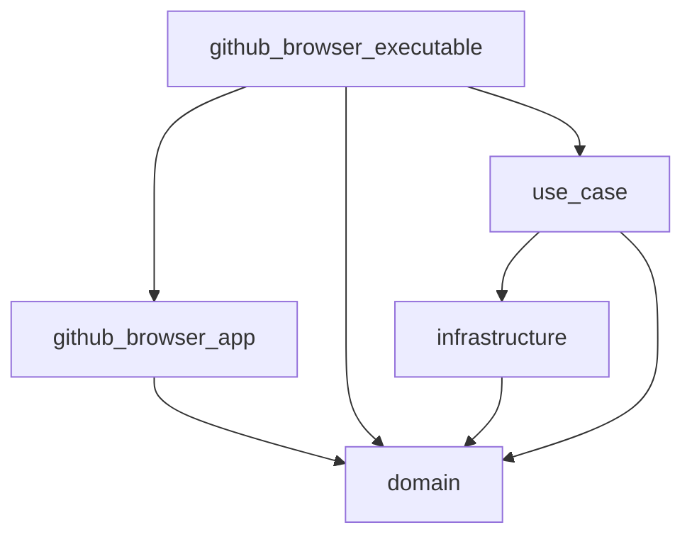
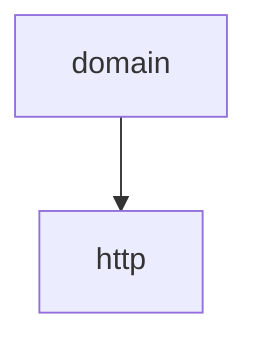
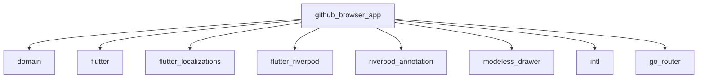
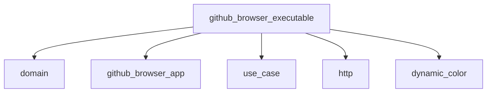
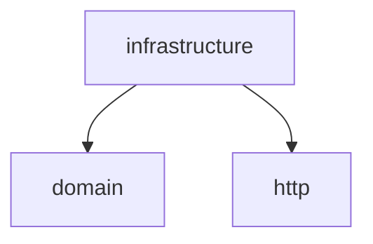
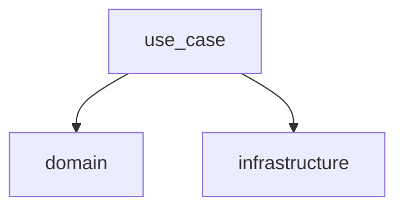

### 自作パッケージ間の依存性のみのグラフ

```mermaid
graph TD;
    github_browser_app["github_browser_app"] --> domain;
    github_browser_executable["github_browser_executable"] --> domain;
    github_browser_executable --> github_browser_app;
    github_browser_executable --> use_case;
    infrastructure["infrastructure"] --> domain;
    use_case["use_case"] --> domain;
    use_case --> infrastructure;
```

### 各自作パッケージが依存しているパッケージのグラフ

#### domainの依存性

```mermaid
graph TD;
    domain["domain"] --> http;
```

#### github_browser_appの依存性

```mermaid
graph TD;
    github_browser_app["github_browser_app"] --> domain;
    github_browser_app --> flutter;
    github_browser_app --> flutter_localizations;
    github_browser_app --> flutter_riverpod;
    github_browser_app --> riverpod_annotation;
    github_browser_app --> modeless_drawer;
    github_browser_app --> intl;
    github_browser_app --> go_router;
```

#### github_browser_executableの依存性

```mermaid
graph TD;
    github_browser_executable["github_browser_executable"] --> domain;
    github_browser_executable --> github_browser_app;
    github_browser_executable --> use_case;
    github_browser_executable --> http;
    github_browser_executable --> dynamic_color;
```

#### infrastructureの依存性

```mermaid
graph TD;
    infrastructure["infrastructure"] --> domain;
    infrastructure --> http;
```

#### use_caseの依存性

```mermaid
graph TD;
    use_case["use_case"] --> domain;
    use_case --> infrastructure;
```